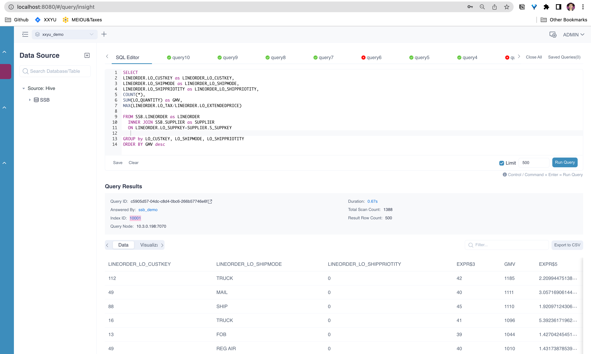

# How to debug Kylin in IDEA using docker

## Background

#### Why debug Kylin in IDEA using docker
This article aims to introduce a simple and useful way to develop and debug Kylin for developer, and provided similar deployment to user's real scenario. 

This guide assumes you use Laptop such as Macbook to do development work, and have another remote linux server for testing and deployment purpose.
Windows is not verified at the moment.

You have to prepare:
- Docker Desktop on Mac(and Docker Engine on Linux Server if needed)
- IntelliJ IDEA and kylin's source code

Tips:
It is **recommended** to use remote server to deploy Hadoop Cluster, because 7-8 containers may consume a lot of hardware resources and cause your laptop run slower than before.

#### Deployment architecture
Following is architecture of current deployment.


## Prepare IDEA and build source code
#### Build source code
- Build back-end source code before your start debug.
```shell
mvn clean install -DskipTests
```

- Build front-end source code. 
(Please use node.js v12.14.0, for how to use specific version of node.js, please check [how to package](./how_to_package.md) )
```shell
cd kystudio
npm install
```

#### Prepare IDEA configuration
- Download spark and create running IDEA configuration for debug purpose.
```shell
./dev-support/sandbox/sandbox.sh init
```

- Following is the shell output.


## Prepare the Hadoop Cluster

#### Deploy Hadoop Cluster
- Install latest docker desktop in your laptop
- [**Optional**] Install docker engine on remote machine (https://docs.docker.com/engine/install/)
- [**Optional**] If you want to deploy hadoop cluster on remote machine, please set correct `DOCKER_HOST`

```shell
# see more detail at : https://docs.docker.com/compose/reference/envvars/#docker_host
export DOCKER_HOST=ssh://${USER}@${DOCKER_HOST}
```

- Check available resource of your docker engine which you want to deploy Hadoop Cluster, make sure you leave 6 CPUs and 12 GB memory at least .

Following is the setting page of Docker Desktop of MacBook.


- Deploy hadoop cluster via docker compose on laptop(or on remote machine)

```shell
./dev-support/sandbox/sandbox.sh up
```


#### Check status of hadoop cluster
- Wait 1-2 minutes, check health of hadoop, you can use following command to check status

```shell
./dev-support/sandbox/sandbox.sh ps
```

Following output content shows all hadoop component are in health state.


- Edit `/etc/hosts`. (if you deployed Hadoop cluster on remote machine, please use correct ip address other than `127.0.0.1` .)
```shell
127.0.0.1 namenode datanode resourcemanager nodemanager historyserver mysql zookeeper hivemetastore hiveserver 
```

- Load sample SSB data into HDFS and Hive
```shell
./dev-support/sandbox/sandbox.sh sample
```

- Check hive table


## Debug Kylin in IDEA

#### Start backend in IDEA

- Select "BootstrapServer[docker-sandbox]" on top of IDEA and click **Run** .

![click BootstrapServer[docker-sandbox]](images/how-to-debug-05.png)

- Wait and check if Sparder is start succeed.


- Check if SparkUI of Sparder is started.


#### Start frontend in IDEA

- Set up dev proxy
```shell
cd kystudio
npm run devproxy
```


#### Validate Kylin's core functions

- Visit Kylin WEB UI in your laptop


- Validate Cube Build and Query function





## Command manual
1. Use `./dev-support/sandbox/sandbox.sh stop` to stop all containers
2. Use `./dev-support/sandbox/sandbox.sh start` to start all containers
3. Use `./dev-support/sandbox/sandbox.sh ps` to check status of all containers
4. Use `./dev-support/sandbox/sandbox.sh down` to stop all containers and delete them

## Q&A

// todo
