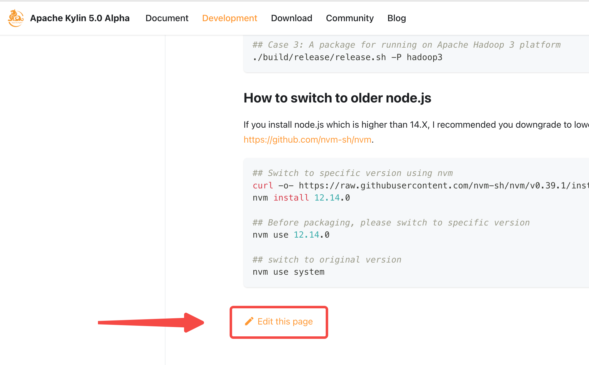

From Kylin 5.0, Kylin community proposed to write documents using [Docusaurus](https://docusaurus.io/). Please note multi-version and i18n(multi-language) is in our plan, so it is not supported right now.

### Shortcut: Edit a single existent page

If you found some minor typos or mistakes on a single page, you can quickly commit the change without clone source code and preview in user's local machine.

Just scroll down the page to the bottom and click the `Edit this page`.



Edit the page.


Raise a pull request.


> Note: If you want to add NEW pages/upload images/change frontend style, please do as following steps.

## Before your work

Before you add new documentation, please deploy the document compilation environment.

There are two steps:

- [Deploy a local document compilation environment](#Deploy)
- [Download repo](#Download)

### <span id="Deploy">Deploy a local document compilation environment</span>

Install following tools before you add or edit documentation:  

1. First, make sure [Node.js](https://nodejs.org/en/download/) version 16.14 or above (which can be checked by running node -v) on your machine. You can use [nvm](https://github.com/nvm-sh/nvm) for managing multiple Node versions on a single machine installed.

    - When installing Node.js, you are recommended to check all checkboxes related to dependencies.

    > More about requirement about [Docusaurus](https://docusaurus.io/), please refer to [Docusaurus Installation](https://docusaurus.io/docs/installation).
   

2. And optionally any markdown editor you prefer

### <span id="Download">Download docs repo</span>

1. Download the doc repo to any path you prefer.

```shell
cd /path/you/prefer/to
git clone --branch doc5.0 https://github.com/apache/kylin.git # Or git clone -b doc5.0 https://github.com/apache/kylin.git
```

2. After pre-step, install dependencies for prerequisite of doc.
   
```shell
cd website
npm install
```

To check if that environment works well, run:

```shell
npm run start
```
   
then, home page doc (`http://localhost:3000`) will automatically open in your default browser and no errors occurred.


## How to create new document

### Create a new markdown file

Open doc with any markdown editor, draft content as following:

```
---
title: Example doc
language: en
sidebar_label: Example doc
pagination_label: Example doc
toc_min_heading_level: 2
toc_max_heading_level: 6
pagination_prev: null
pagination_next: null
keywords:
    - doc
draft: false
last_update:
    date: 08/23/2022
---

## This is example doc
The quick brown fox jump over the lazy dog.
```

> ***Note***:
>   
>   1. Please note that every doc need the ___Head metadata___. More details about `Head metadata` of a doc, please refer to [Head metadata](https://docusaurus.io/docs/markdown-features/head-metadata).
>   
>   2. Please use the template `Head metadata` in your modified doc.
    ```shell
    ---
    title: Example doc
    language: en
    sidebar_label: Example doc
    pagination_label: Example doc
    toc_min_heading_level: 2
    toc_max_heading_level: 6
    pagination_prev: null
    pagination_next: null
    keywords:
        - doc
    draft: false
    last_update:
        date: 08/23/2022
    ---
    ```
> 
>   3. Please use `second heading level` for the doc header start.


### How to add a new page to the sidebar

Add the `{}` doc side block in sideBars.

Example:

Scene: If you want to add the sidebar of `how_to_write_doc.md` to be the children menu of `development`.

Then, modify the `DevelopmentSideBar` block in sidebars.js and add a new block in the `items` of `DevelopmentSideBar`.

```shell
DevelopmentSideBar: [
    {
        ...
        items: [
            {...},
            ...,
            {
                type: 'doc',
                id: 'development/how_to_write_doc.md'
            },
        ],
    },
],              
```


### Preview in your local machine
You can preview in your browser, to check exactly what it will look like, please run following commands in the `website` directory of repo folder:

```
npm run start
```
Then access http://127.0.0.1:3000 in your browser.

If everything is normal, create a pull request to [Apache Kylin Repo](https://github.com/apache/kylin) and target branch is `doc5.0`.

## Documentation Specification

### About [Docusaurus](https://docusaurus.io/)

[Docusaurus](https://docusaurus.io/) is a static-site generator. It builds a single-page application with fast client-side navigation, leveraging the full power of React to make your site interactive. It provides out-of-the-box documentation features but can be used to create any kind of site (personal website, product, blog, marketing landing pages, etc).

Apache Kylin's website and documentation is using [Docusaurus](https://docusaurus.io/) to manage and generate final content which avaliable at [http://kylin.apache.org](http://kylin.apache.org).

### Kylin document structure and navigation menu

The Kylin [website as the Docusaurus source](https://github.com/apache/kylin/tree/document/doc5.0) is maintained under the `doc5.0` branch.

1. __Home Page__: Home page of Docs
2. __Document__: General docs about Apache Kylin, including _Installation_, _Tutorial_, etc.
3. __Development__: _"development"_ For developer to contribute, integration with other application and extend Apache Kylin
4. __Download__: _"Download"_ Apache Kylin packages
5. __Community__: Apache kylin Community information
6. __Blog__: Technic blogs about Apache Kylin

### Full doc structure

The full doc structure about the newest Apache Kylin:

```shell
doc5.0
.
├── README.md
├── babel.config.js
├── blog
│ ├── ...
├── docs
│ ├── community.md
│ ├── configuration
│ │ ├── ...
│ ├── datasource
│ │ ├── ...
│ ├── deployment
│ │ ├── ...
│ ├── development
│ │ ├── ...
│ ├── download.md
│ ├── integration
│ │ └── intro.md
│ ├── intro.md
│ ├── modeling
│ │ ├── ...
│ ├── monitor
│ │ ├── ...
│ ├── operations
│ │ ├── ...
│ ├── powerBy.md
│ ├── query
│ │ ├── ...
│ ├── quickstart
│ │ ├── ...
│ ├── restapi
│ │ ├── ...
│ ├── snapshot
│ │ ├── ...
│ └── tutorial
│     ├── ...
├── docusaurus.config.js
├── package.json
├── sidebars.js
├── src
│ ├── components
│ │ └── ...
│ ├── css
│ │ └── ...
│ └── pages
│     ├── ...
├── static
│ └── img
│     ├── ...
```

More details about structure which managed by Docusaurus, please refer to [Project structure rundown](https://docusaurus.io/docs/installation#project-structure-rundown).

### Navigation menu

The menu is managed by Docusaurus collection:

* __sidebars.js__: All language version menu structure. Docusaurus can hold only one menu file to map any language version menu.

More details about sidebars in Docusaurus, please refer to [Sidebar](https://docusaurus.io/docs/sidebar).


### How to add image
All image should be put under _images_ folder, in your document, please using below sample to include image:

```

```


### How to link to another page
Using relative path for site links, for example:

```
[How To Write Docs](../development/how_to_write_doc). 
```

### How to add code highlight
We are using [Rouge](https://github.com/jneen/rouge) to highlight code syntax, check this doc for more detail sample.
